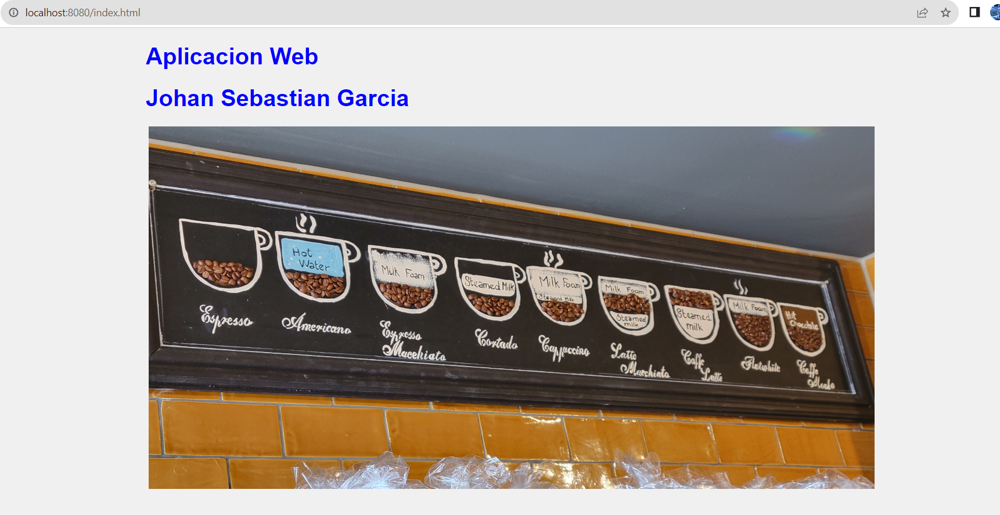

# APLICACIONES DISTRIBUIDAS

    Las aplicaciones distribuidas son sistemas de software compuestos por múltiples componentes que se ejecutan en diferentes máquinas y se comunican entre sí a través de una red. Estas pueden variar en complejidad y se pueden comunicar teniendo en cuenta diferentes patrones de conexión entre un cliente y un servidor. En el siguiente proyecto vamos a poder evidenciar el desarrollo de un servidor web y la respuesta a múltiples solicitudes por medio del protocolo de aplicación HTTP para su respectivo funcionamiento.

## Protocolo HTTP 

    Es el protocolo fundamental que permite la comunicación y el intercambio de información en la web. Define cómo los clientes y los servidores se comunican, solicitando y entregando recursos como páginas web, imagenes, archivos, entre otros contenidos.
    Sigue un modelo de cliente-servidor, donde el cliente (navegador web) realiza **solicitudes** al servidor web, quien da **respuesta** con los datos solicitados los cuales estan determinados por **(método, URL, version)** ademas de opcionalmente encabezados y cuerpo, estos **métodos** (get, post, put y delete) indican la acción que el cliente desea realizar con el recurso solicitado.

## Introducción

    En el siguiente proyecto podemos encontrar un servidor web que tendrá la capacidad de esperar y recibir solicitudes del navegador o cliente y nos mostratá como respuesta los archivos solicitados y ubicados en el directorio local que en este caso es una aplicación sencilla realizada con Html,Css y javascript que nos muestra una página con imágen y texto

# Prototipo

    

## Especificación

    Como podemos observar la respuesta del servidor se esta obteniendo a través del puerto 8080 del servidor web local y contiene el esquema del archivo de texto **index.html** la imagen del archivo **image.jpg** y el estilo del archivo **styles.css** los cuales son pedidos por medio de una solicitud del navegador al servidor y este por medio de un método **GET** del protocolo **http** da como respuesta a lo que vemos en pantalla

    En primera medida se habilita un socket para el servidor y se define el puerto de acceso por donde se va a comunicar, luego se solicita o espera y asigna la solicitud que se genere por medio del navegador para así poder enviarla al servidor y este pueda definir el o los archivos que se desean transmitir

    '''public static void main(String[] args) {
        int port = 8080;
        try (ServerSocket serverSocket = new ServerSocket(port)) {
            System.out.println("Servidor web en funcionamiento en el puerto " + port);
            while (true) {
                //Request
                Socket clientSocket = serverSocket.accept();
                //Request Thread
                Thread requestHandler = new Thread(() -> handleRequest(clientSocket));
                requestHandler.start();
            }
        } catch (IOException e) {
            e.printStackTrace();
        }
    }'''

    En este punto el servidor debe definir qué tipo de archivos esta solicitando el navegador y si en efecto estos son existentes en el directorio se deben retornar hacia el cliente por medio del puerto establecido

    La solicitud la hace el navegador por medio del protocolo HTTP preestablecido con su respectivo método GET el cual define el la dirección donde debe buscar el servidor y la versión del protocolo

    Una vez realizada la transferencia de datos se debe cerrar el flujo del socket del navegador 